???+ success "Updated 2/24/25"
    Guide was updated to reflect the new AMP UI and settings.

# AMP Install Guide

This is a guide for installing ATM10 (and possibly other packs) on CubeCoderz's AMP gameserver hosting software!

???+ info 
	The current version of AMP as of the creation of this guide is **2.6.0.12**. As the software is updated, the exact location of settings may change.

???+ warning
	This guide is currently hosted by the official ATM website/Discord. If found anywhere else please advise them to delete it and instead link to this [official version](https://allthemods.github.io/alltheguides/help/server/).

???+ note "This guide assumes:"
	- You have fully installed the AMP software and have successfully gained access to the web based GUI. If you need help installing the base software please refer to the [CubeCoderz Documentation](https://github.com/CubeCoders/AMP/wiki).
	- You have already downloaded the latest version of the [ATM Pack ServerFiles](https://legacy.curseforge.com/members/atmteam/projects) and have unzipped them into a folder.

## Creating a New Instance.

- Under **Select Application**, choose **Minecraft Java Edition**.
- Under **Friendly Name**, pick a name to reference the server such as **ATM10**.
- Under **After Creation**, pick **Do Nothing**.
    - If you do not want the instance to start every time AMP is started, uncheck the **Start Instance on Boot** option. This is **ON** by default.
- Select **Create Instance**

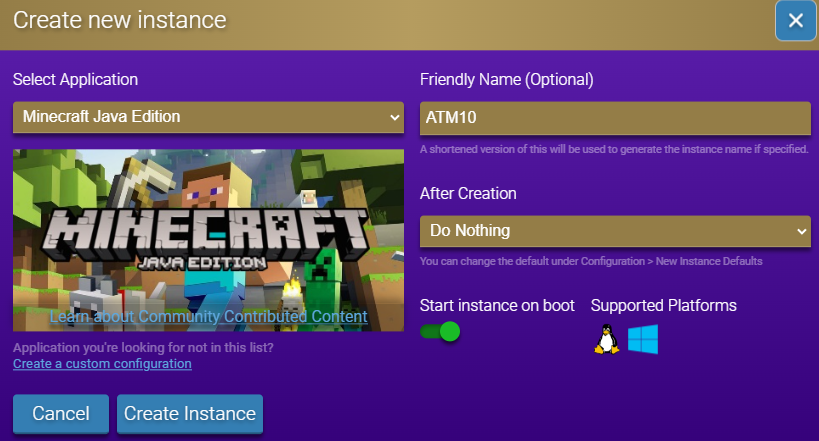

---

## Configuring Server Settings

- Choose **Manage** from the newly created instance

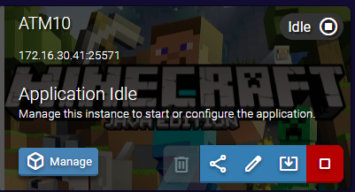

- On the left menu, select **Configuration** and then **Minecraft**

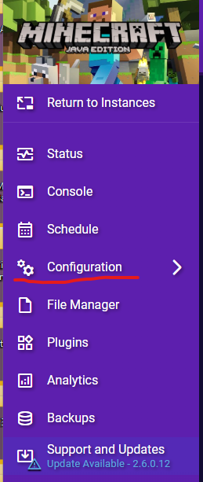
.png)

---

The tabs on the top show the different categories

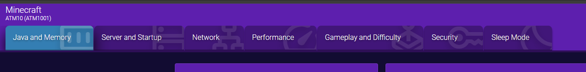

---

### Java and Memory

- **Memory Limit (MB)**: Min: `6144`. Max: `16384`.
    - `12000`+ is recommended for multiple players.
- **Additional java options**: Paste in the server java arguments (this example uses the advanced ZGC arguments)

!!! example ""
	`-XX:+UseZGC -XX:+ZGenerational -XX:SoftMaxHeapSize=6g -XX:+DisableExplicitGC -XX:+AlwaysPreTouch -XX:+PerfDisableSharedMem -XX:+UseDynamicNumberOfGCThreads`

- **Java Version**: `Java 21`
???+ note
	If `Java 21` is not in the dropdown list, you need to close AMP completely, install `Java 21` to the server, then restart AMP.

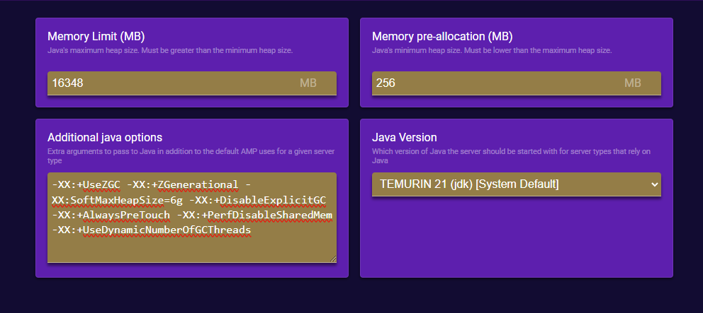

---

### Server and Startup

- **Server type**: `NeoForge`
- **NeoForge Version**: Change to current NeoForge version.
	- For this example the current version is `21.1.119`.

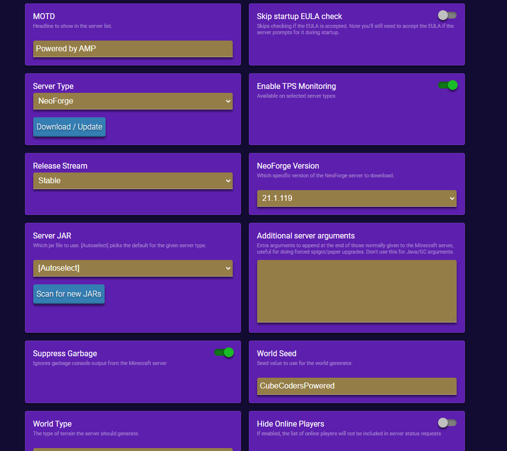

---

### Network

Make no changes

---

### Gameplay and Difficulty

- **Difficulty**: Normal (or personal preference)
- **Op permission level**: `3: Kick/ban/op players`
- **Spawn Protection Radius**: `1` (or personal preference)
- **Allow Flight**: `on`
- **Allow Command Blocks**: `on`

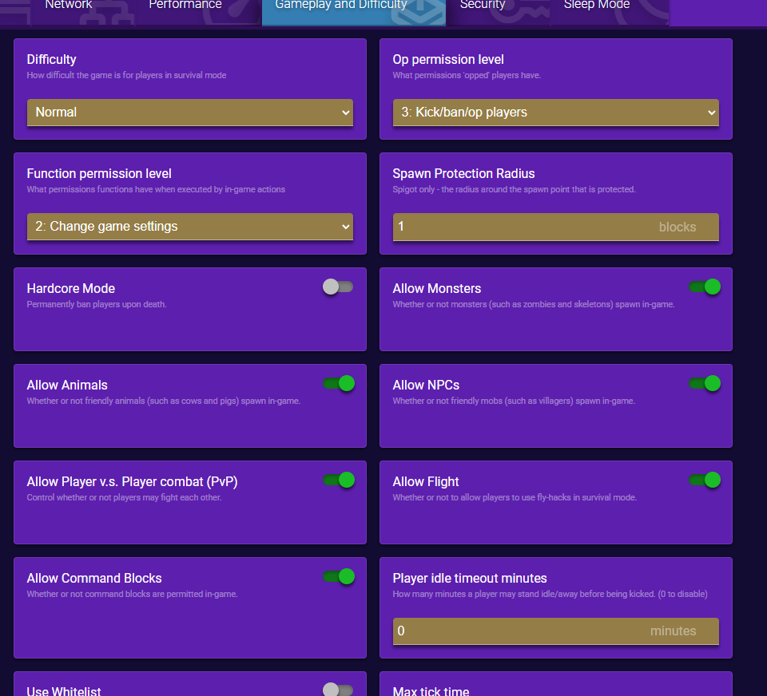

---

### Security

Make no changes

---

### Sleep Mode

- **Enable sleep mode**: `off`

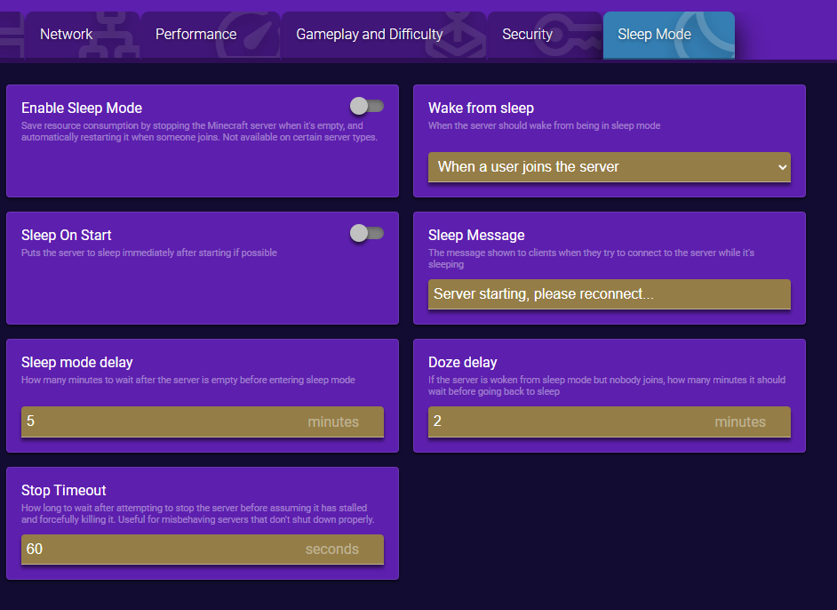

---

### System Settings

- **Console Scrollback Period**: `120`

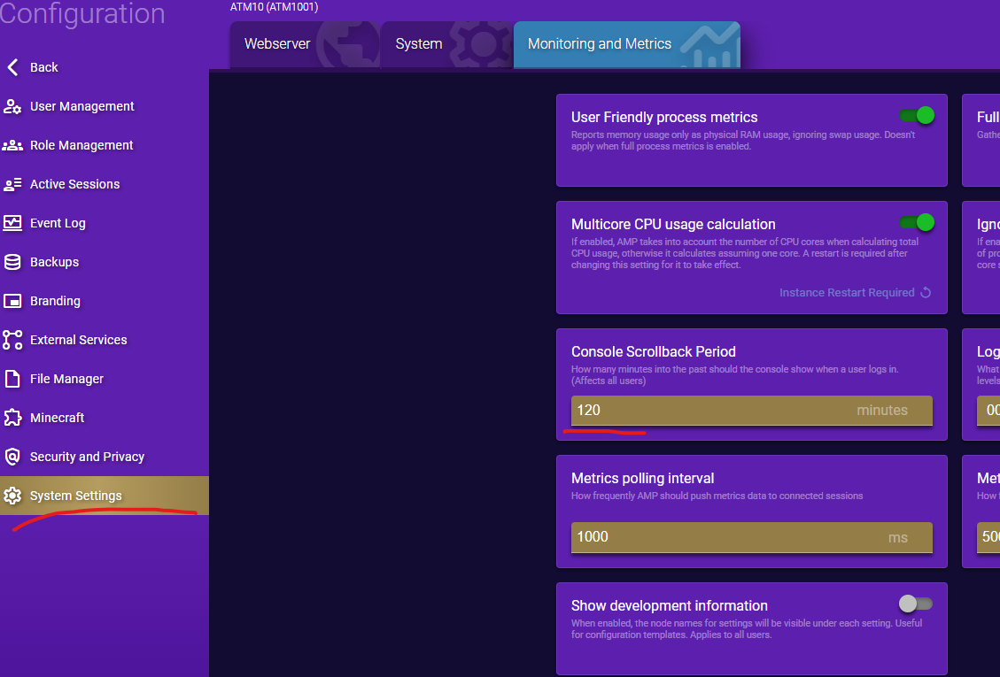

---

## Installing Server NeoForge

Click the **Back** arrow at the top of the left menu.

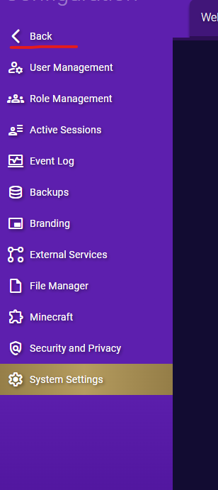

Select **Console** from the left menu and then click the orange **Update** icon from the middle screen.

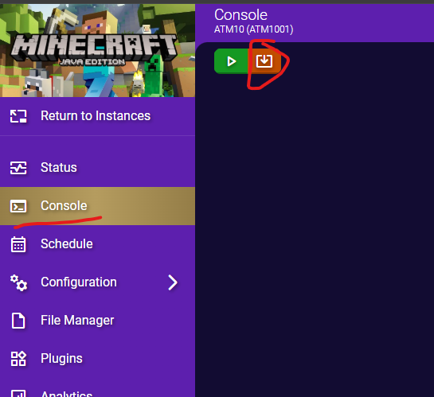

Wait while the server downloads and installs the selected NeoForge version.

!!! note "This can take several minutes depending on your server specs and internet connection."

When it finishes, it should say **The server installed successfully**. If it doesn't, please doublecheck the above settings and verify you have selected the appropriate NeoForge Version.

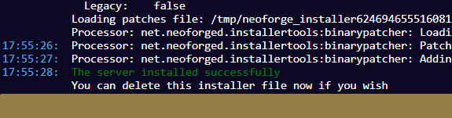

---

## Importing the Server Files

On the left menu, select **File Manager**.

The easiest way to import the server files is to unzip the files and create a new zip.

- To remove the double-wrapping (zipping a folder instead of a group of files) of the files:
	- **Extract** the server files you downloaded from CurseForge into a folder.
	- Go into the folder inside that folder and then select **all the files** and re-zip them without the containing folder.
	
I recommend using **7zip** as this is what I have used for testing.
!!! warning "Make sure you save as .zip and not .7z"

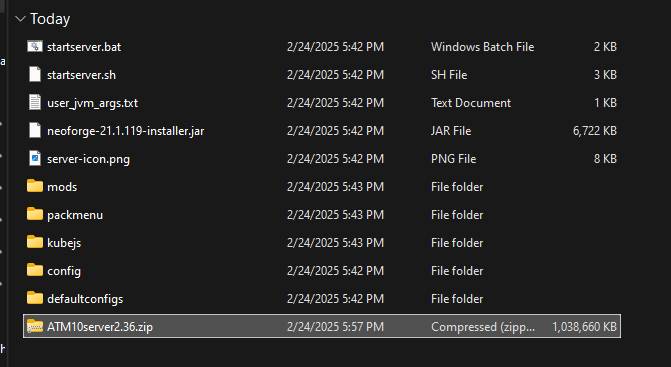

---

Drag the newly created zip file into the **File Manager window**. Once it finishes you may need to refresh the page to see the file in the file list.

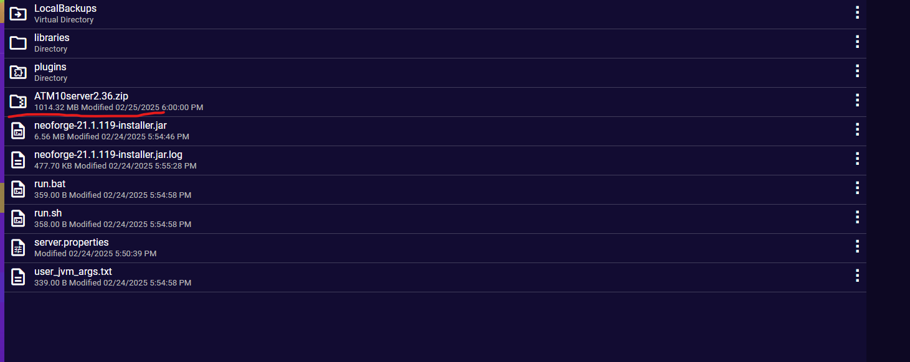

---

Right click the .zip file in the list and chose **Extract Here**. 

!!! info "This may take several minutes depending on your server specs and storage speed."

Once it finishes you may need to **refresh** the page to see the newly extracted files populated in the list.

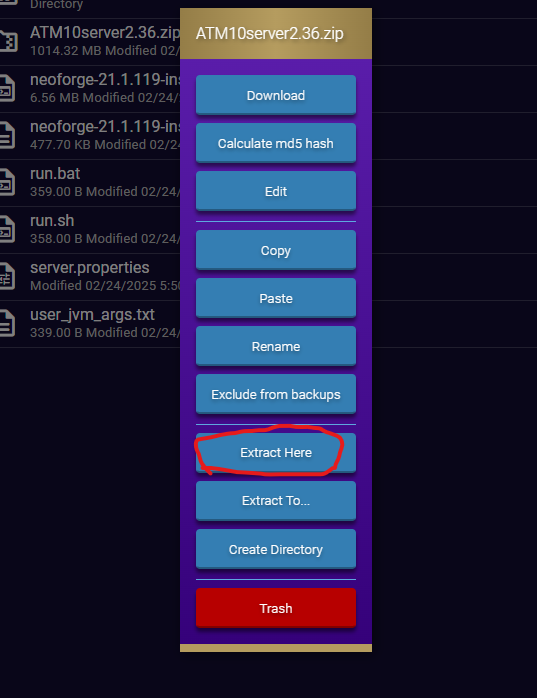
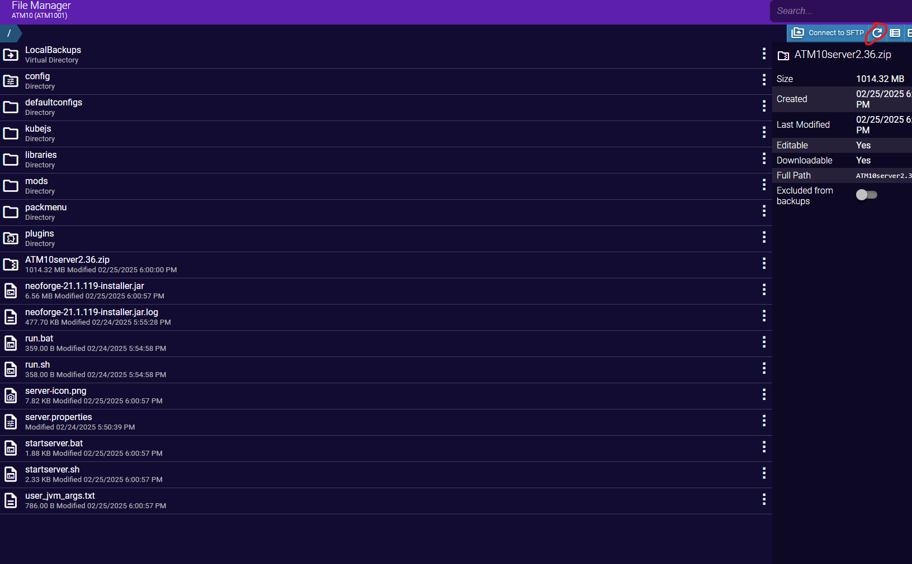

---

## Starting the Server

Select **Console** from the left menu and click the green **Start** icon.

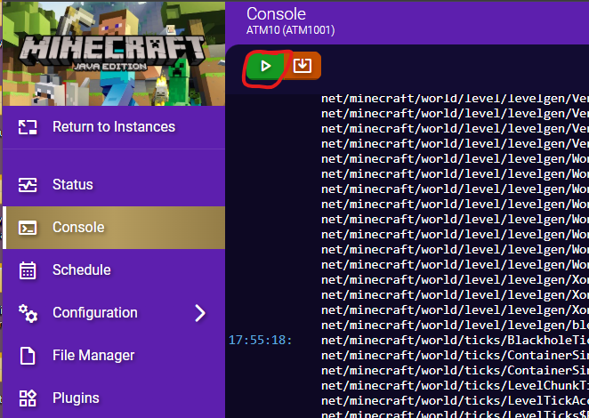

- Accept the EULA that pops up.

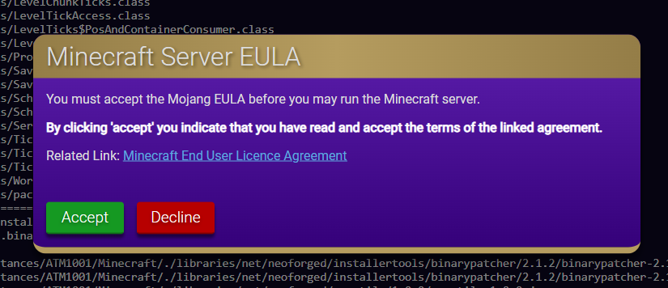

---

The server will now start. This can take several minutes depending on your server specs and storage speed.

???+ note
	Errors are normal and to be expected as long as it continues loading. Be patient as the first startup usually takes time while it creates all the needed files/configs/folders/etc.
	
You will know it is finished when the notification window in the bottom right disappears and the server says **Dedicated server took XXX.XX seconds to load**.

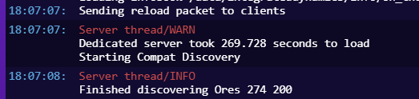

---

It is recommended after the first startup, to stop the server using the red **Stop** button at the top, and then start it again.

- Try to connect to the server and verify operation.
- If you need to add server admin mods, you would place them inside the **mods** folder under **File Manager** while the server is ***stopped***; you can edit files directly from within the file manager in AMP for making changes to the txt config files. 
!!! danger "Only edit, add, or remove files WHILE THE SERVER IS STOPPED!"

## Changing Server Properties

!!! warning "CHANGES TO `server.properties` FILE WILL NEVER SAVE!"

All settings within `server.properties` are in independent tabs in the various settings in AMP and it is recreated every server startup.

???+ example "Changing Server Type"
	If you need to edit the world type for example, to run a **Skyblock** server, you would change it under `Configuration > Minecraft > Server and Startup`.

> All The Mods | [GitHub](https://github.com/AllTheMods) | [Discord](https://discord.com/invite/allthemods) | [CubeCoders: AMP](https://cubecoders.com/AMP)
